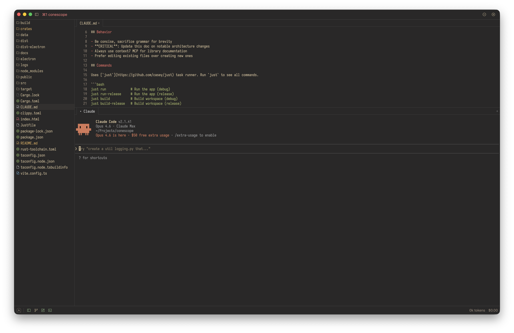
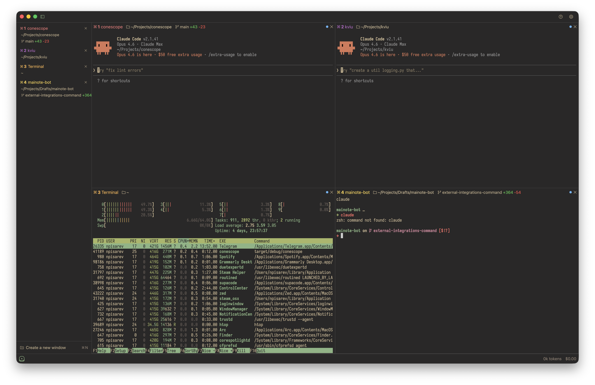

<p align="center">
  <h1 align="center">📺 Conescope</h1>
  <p align="center">Native macOS app for managing multiple Claude Code CLI instances in a unified interface.<br>Built with Rust and <a href="https://github.com/nicehash/gpui-standalone">GPUI</a> (from Zed editor).</p>
</p>

<p align="center">
  
</p>

## Features

- **Overview Grid** — monitor multiple Claude Code sessions with live terminal previews
- **Focus View** — full terminal + file editor + git panel for individual instances
- **Sidebar** — instance list with project info, git branch/stats, click-to-rename; pinned or overlay mode
- **File Tree** — browse project files, open in editor, context menu actions
- **Git Integration** — staged/unstaged files, diffs, stage/unstage/discard via sidebar panel
- **Project Management** — organize instances by project with custom colors
- **Question Tracking** — surface pending questions across all instances
- **SQLite Persistence** — sessions, settings, and layout survive restarts
- **Keyboard-Driven** — `Cmd+1..9` instance switching, panel toggles, vim-style navigation

### Focus View

<p align="center">
  
</p>

## Tech Stack

- **UI**: [GPUI](https://github.com/nicehash/gpui-standalone) (Zed's GPU-accelerated framework)
- **Terminal**: [alacritty_terminal](https://github.com/nicehash/alacritty) (Zed's fork, pure Rust VT parser)
- **PTY**: [portable-pty](https://docs.rs/portable-pty)
- **Database**: [rusqlite](https://docs.rs/rusqlite) (SQLite, WAL mode)
- **Git**: [git2](https://docs.rs/git2) (reads) + shell git CLI (writes)

## Requirements

- macOS 11+
- Rust 1.85+ (edition 2024)
- zig 0.14 (`brew install zig@0.14 && brew link zig@0.14 --force`) — required by GPUI's C compilation
- [Claude Code CLI](https://docs.anthropic.com/en/docs/claude-code) installed

## Development

Uses [`just`](https://github.com/casey/just) task runner:

```bash
just run              # Run (debug)
just run-release      # Run (release)
just build            # Build workspace
just check            # Clippy lint (deny warnings)
just test             # Run all tests
just fmt              # Auto-format
just verify           # Pre-commit gate: fmt-check + clippy + test
just fix              # Auto-format, then clippy + test
```

Always run `just verify` before committing.

## Workspace

```
crates/
├── conescope/          # Binary — app entry, window setup, keybindings
├── conescope-ui/       # GPUI views, state management, actions
├── conescope-core/     # Data types, SQLite models, migrations
├── conescope-git/      # Git operations (hybrid git2 + CLI)
├── conescope-pty/      # PTY spawning via portable-pty
└── conescope-platform/ # macOS-specific (window styling)
```

## License

ISC
